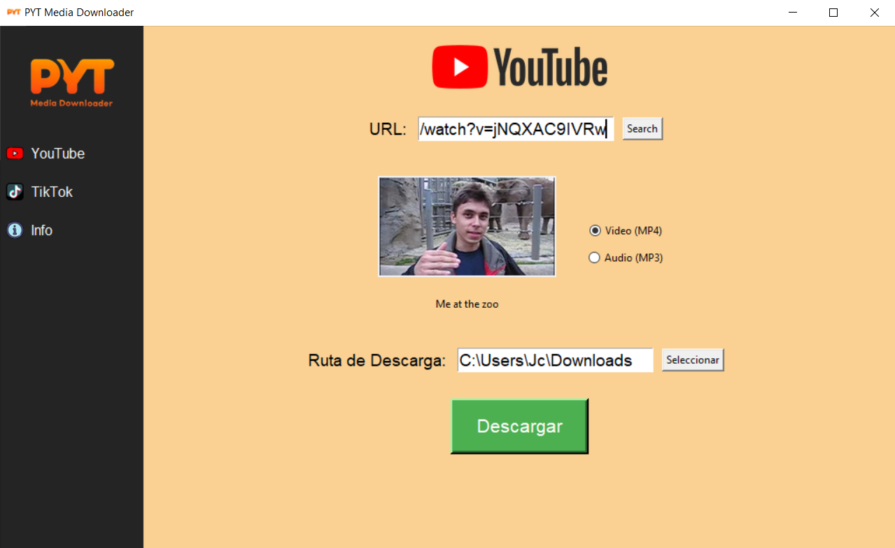

# PYT Media Downloader

PYT is a project created as a training tool to download video or audio from various platforms. 
## Screenshots??

## Guidelines and Responsibilities??
It is essential that users understand the restrictions and responsibilities when using this application. Make sure to read and accept the terms of service of YouTube and various platforms before downloading any content. Here are some key points to keep in mind when using this application:

**Copyright:** Downloading copyrighted videos without proper authorization is illegal. Only download content for which you have the appropriate rights or that is in the public domain.

**Personal Use:** Video downloads should be limited to personal use and comply with copyright laws and YouTube's terms of service. Commercial use is not allowed without authorization.

**Legal Information:** This application uses the YouTube Data API to retrieve information about videos. Ensure compliance with the YouTube Data API terms of service.

**Quality and Formats:** When downloading videos, select the appropriate quality and format according to options allowed by YouTube and its API. Do not bypass platform restrictions.

**User Responsibility:** Users are responsible for any violation of YouTube's terms of service or copyright laws. The application and its developer do not endorse or promote illegal downloading or misuse of content.

**Updates and Compliance:** The application may require updates to comply with changes in YouTube's terms of service. Users should review and accept any updates before continuing to use the application.

Remember, the goal is to promote responsible and ethical use of the application, always respecting copyright and policies.

## Directrices y Responsabilidades??
Es esencial que los usuarios comprendan las restricciones y responsabilidades al utilizar esta aplicación. Asegúrate de leer y aceptar los términos de servicio de YouTube y las distintas plataformas antes de descargar cualquier contenido. Aquí hay algunos puntos clave que debes tener en cuenta al usar esta aplicación:

**Derechos de Autor:** Descargar videos protegidos por derechos de autor sin la debida autorización es ilegal. Solo descarga contenido para el cual tengas los derechos adecuados o que esté en el dominio público.

**Uso Personal:** La descarga de videos debe limitarse al uso personal y cumplir con las leyes de derechos de autor y términos de servicio de YouTube. No se permite el uso comercial sin autorización.

**Información Legal:** Esta aplicación utiliza la API de YouTube Data para obtener información sobre los videos. Asegúrate de cumplir con los términos de servicio de YouTube Data API.

**Calidad y Formatos:** Al descargar videos, selecciona la calidad y formato apropiados según las opciones permitidas por YouTube y su API. No eludas las restricciones de la plataforma.

**Responsabilidad del Usuario:** Los usuarios son responsables de cualquier violación de los términos de servicio de YouTube o de las leyes de derechos de autor. La aplicación y su desarrollador no respaldan ni promueven la descarga ilegal o el mal uso del contenido.

**Actualizaciones y Cumplimiento:** La aplicación puede requerir actualizaciones para cumplir con los cambios en los términos de servicio de YouTube. Los usuarios deben revisar y aceptar cualquier actualización antes de continuar utilizando la aplicación.

Recuerda, el objetivo es promover un uso responsable y ético de la aplicación, respetando siempre los derechos de autor y las políticas.